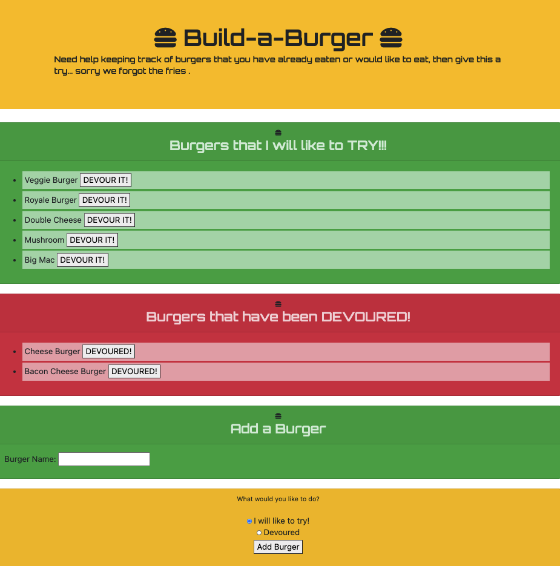

# build-a-Burger

  

## *Description* 

Build-a-Burger! is a Burger app that lets users input the names of burgers they'd like to eat or have already eaten.
Whenever a user submits a burger's name, the created burger will appear on the top section "Burgers that I will like to TRY!!!", unless the User selects the button "devoured" from the bottom section - where the Burger will then display from "Burgers that have been DEVOURED!".
If the User has already devoured a burger from the waiting to be tried section it will be added to the list.
The app stores every burger in a database, whether DEVOURED or not.

## *Technologies*
      
- HTML
- CSS
- JavaScript
- JQuery
- Node.js
- NPM 
    (MySQL)
    (Express)
    (Handlebars)
    (Homemade ORM)
       
## *Usage* 
 > https://guarded-temple-17498.herokuapp.com/
 

  
## *How to Use*
 The application can be easily accessed by visiting the following: https://guarded-temple-17498.herokuapp.com/

## *Author Info*  
  
> Email: joselarojr@gmail.com
- GitHub User: JRLaro
  
## *Credits // License*
      
No collaborators were harmed in the making of this application

> MIT License
Copyright (©) 2020, J.Laro

Permission is hereby granted, free of charge, to any person obtaining a copy of this software and associated documentation files (the "Software"), to deal in the Software without restriction, including without limitation the rights to use, copy, modify, merge, publish, distribute, sublicense, and/or sell copies of the Software, and to permit persons to whom the Software is furnished to do so, subject to the following conditions:

The above copyright notice and this permission notice shall be included in all copies or substantial portions of the Software.

THE SOFTWARE IS PROVIDED "AS IS", WITHOUT WARRANTY OF ANY KIND, EXPRESS OR IMPLIED, INCLUDING BUT NOT LIMITED TO THE WARRANTIES OF MERCHANTABILITY, FITNESS FOR A PARTICULAR PURPOSE AND NONINFRINGEMENT. IN NO EVENT SHALL THE AUTHORS OR COPYRIGHT HOLDERS BE LIABLE FOR ANY CLAIM, DAMAGES OR OTHER LIABILITY, WHETHER IN AN ACTION OF CONTRACT, TORT OR OTHERWISE, ARISING FROM, OUT OF OR IN CONNECTION WITH THE SOFTWARE OR THE USE OR OTHER DEALINGS IN THE SOFTWARE.